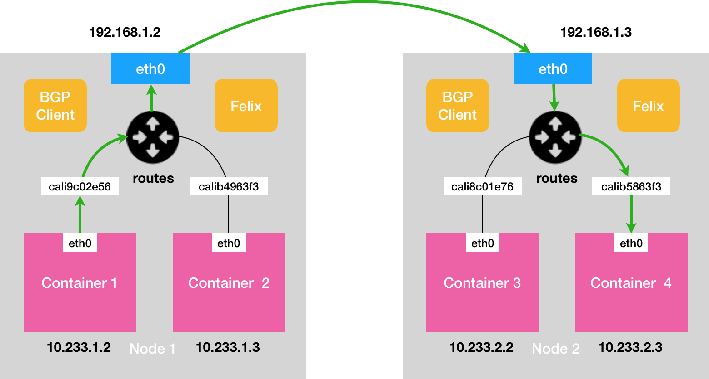

# K8S notes

## Docker

Docker 本质上就是一个进程clone的时候加上了各种参数来对PID，网络，IPC，文件系统进行namespace的隔离。但是他们还是共享同一个操作系统内核，有的资源并不能做隔离，比如说系统时间。  

有了隔离之后，还要用cgroup（contianer groups）对它做限制，以防被隔离的进程大量占用host上的资源。  

对于文件系统比较特殊，即使开启了对mount点的namespace隔离，不重新mount的情况下，这个mount是不能生效的，container里面的进程看到文件系统和host的文件系统是一致的。这就需要用chroot来给container进程切换根目录，chroot之后，container进程看到的就是自己的“/”，在这个root下面有着rootfs，这个rootfs里面由操作系统的文件，目录和配置以及运行环境的依赖，但是它并不是真正的内核，它的存在保证了不论container怎么迁移，运行程序的环境都是一致的。  

为了制作这个rootfs，docker借用了unionFS（AuFS），引入了layer的概念，也就是说，用户制作镜像的每一步操作，都会生成一个层，也就是一个增量 rootfs。比如：

``` shell
$ docker image inspect ubuntu:latest
     "RootFS": {
      "Type": "layers",
      "Layers": [
        "sha256:f49017d4d5ce9c0f544c...",
        "sha256:8f2b771487e9d6354080...",
        "sha256:ccd4d61916aaa2159429...",
        "sha256:c01d74f99de40e097c73...",
        "sha256:268a067217b5fe78e000..."
      ]
    }

```

可以看到，这个 Ubuntu 镜像，实际上由五个层组成。这五个层就是五个增量 rootfs，每一层都是 Ubuntu 操作系统文件与目录的一部分；而在使用镜像时，Docker 会把这些增量联合挂载在一个统一的挂载点上/var/lib/docker/aufs/mnt, 而这个挂载点上看到的就是一个完整的ubuntu操作系统

```shell
/var/lib/docker/aufs/mnt/6e3be5d2ecccae7cc0fcfa2a2f5c89dc21ee30e166be823ceaeba15dce645b3e

$ ls /var/lib/docker/aufs/mnt/6e3be5d2ecccae7cc0fcfa2a2f5c89dc21ee30e166be823ceaeba15dce645b3e
bin boot dev etc home lib lib64 media mnt opt proc root run sbin srv sys tmp usr var
```  

这五个镜像层，又是如何被联合挂载成这样一个完整的 Ubuntu 文件系统的呢？这个信息记录在 AuFS 的系统目录 /sys/fs/aufs 下面。

首先，通过查看 AuFS 的挂载信息，我们可以找到这个目录对应的 AuFS 的内部 ID（也叫：si）：

```shell

$ cat /proc/mounts| grep aufs
none /var/lib/docker/aufs/mnt/6e3be5d2ecccae7cc0fc... aufs rw,relatime,si=972c6d361e6b32ba,dio,dirperm1 0 0
```  

即，si=972c6d361e6b32ba。然后使用这个 ID，你就可以在 /sys/fs/aufs 下查看被联合挂载在一起的各个层的信息：

```shell

$ cat /sys/fs/aufs/si_972c6d361e6b32ba/br[0-9]*
/var/lib/docker/aufs/diff/6e3be5d2ecccae7cc...=rw
/var/lib/docker/aufs/diff/6e3be5d2ecccae7cc...-init=ro+wh
/var/lib/docker/aufs/diff/32e8e20064858c0f2...=ro+wh
/var/lib/docker/aufs/diff/2b8858809bce62e62...=ro+wh
/var/lib/docker/aufs/diff/20707dce8efc0d267...=ro+wh
/var/lib/docker/aufs/diff/72b0744e06247c7d0...=ro+wh
/var/lib/docker/aufs/diff/a524a729adadedb90...=ro+wh
```  

我们可以分别查看一下这些层的内容：

```shell

$ ls /var/lib/docker/aufs/diff/72b0744e06247c7d0...
etc sbin usr var
$ ls /var/lib/docker/aufs/diff/32e8e20064858c0f2...
run
$ ls /var/lib/docker/aufs/diff/a524a729adadedb900...
bin boot dev etc home lib lib64 media mnt opt proc root run sbin srv sys tmp usr var
```


这些层有的是只读(ro+wh)，有的是init层，有的是可读写(rw)。  
只读即为以增量的方式分别包含了 Ubuntu 操作系统的一部分。  
init层用来保存用户配置文件，hostname等信息，docker commit不会push这些修改。
RW层的修改会被docker commit提交。  
wh的意思是whiteout，即新建一个空的文件whiteout把就的文件覆盖起来，比如，你要删除只读层里一个名叫 foo 的文件，那么这个删除操作实际上是在可读写层创建了一个名叫.wh.foo 的文件。这样，当这两个层被联合挂载之后，foo 文件就会被.wh.foo 文件“遮挡”起来，“消失”了。这个功能，就是“ro+wh”的挂载方式，即只读 +whiteout 的含义。我喜欢把 whiteout 形象地翻译为：“白障”。

一个进程可以通过setns来加入一个namespace，这就是docker exec的本质。

docker volume 机制，允许你将宿主机上指定的目录或者文件，挂载到容器里面进行读取和修改操作。
挂载技术就是一个inode替换的过程


## k8s component

控制节点，即 Master 节点，由三个紧密协作的独立组件组合而成，它们分别是负责 API 服务的 kube-apiserver、负责调度的 kube-scheduler，以及负责容器编排的 kube-controller-manager。整个集群的持久化数据，则由 kube-apiserver 处理后保存在 Etcd 中。  

而计算节点上最核心的部分，则是一个叫作 kubelet 的组件。  

kubelet 主要负责同容器运行时（比如 Docker 项目）打交道。而这个交互所依赖的，是一个称作 CRI（Container Runtime Interface）的远程调用接口，这个接口定义了容器运行时的各项核心操作，比如：启动一个容器需要的所有参数。这也是为何，Kubernetes 项目并不关心你部署的是什么容器运行时、使用的什么技术实现，只要你的这个容器运行时能够运行标准的容器镜像，它就可以通过实现 CRI 接入到 Kubernetes 项目当中。而具体的容器运行时，比如 Docker 项目，则一般通过 OCI 这个容器运行时规范同底层的 Linux 操作系统进行交互，即：把 CRI 请求翻译成对 Linux 操作系统的调用（操作 Linux Namespace 和 Cgroups 等）。  

此外，kubelet 还通过 gRPC 协议同一个叫作 Device Plugin 的插件进行交互。这个插件，是 Kubernetes 项目用来管理 GPU 等宿主机物理设备的主要组件，也是基于 Kubernetes 项目进行机器学习训练、高性能作业支持等工作必须关注的功能。  

而 kubelet 的另一个重要功能，则是调用网络插件和存储插件为容器配置网络和持久化存储。这两个插件与 kubelet 进行交互的接口，分别是 CNI（Container Networking Interface）和 CSI（Container Storage Interface）。  

## Pods

container 是一个单进程的模型，但并不是说它只支持单进程，只是contanier 进程起来之后代替init或者systemd作为1号进程，并没有管理其他进程的能力，即一个进程通过docker exec加入这个namespace之后，如果他挂了，原进程并不会替他清理回收资源。

Pod是K8S的调度单位，pod是一个逻辑上的概念，它代表着一组contianer，在pod里面的contianer共享网络，文件系统。为了不让同一个pod产生依赖关系，pod里面首先起一个infra contianer（pause），有他来初始化网络和文件系统然后他自己就puase了，后面起来的contianer就可以使用这个pod里面的资源了。

这样pod里面的contianer之间通信很容易，而且对外需要修改网络或者挂载的目录的时候，只用针对pod即可，也就是配置infra pod

pod之前也可以定义依赖关系，成为init container，init contianer会先于用户容器启动。这种模式可以用来作为sidecar模式，用来预先加载volume，处理log，或者代理pods之间通信，而把逻辑交给用户容器。

凡是调度、网络、存储，以及安全相关的属性，基本上是 Pod 级别的。凡是跟容器的 Linux Namespace 相关的属性，也一定是 Pod 级别的。

NodeSelector：是一个供用户将 Pod 与 Node 进行绑定的字段

NodeName：一旦 Pod 的这个字段被赋值，Kubernetes 项目就会被认为这个 Pod 已经经过了调度，调度的结果就是赋值的节点名字。所以，这个字段一般由调度器负责设置
HostAliases：定义了 Pod 的 hosts 文件（比如 /etc/hosts）里的内容

Pod 生命周期的变化，主要体现在 Pod API 对象的 **Status** 部分，这是它除了 Metadata 和 Spec 之外的第三个重要字段。其中，pod.status.phase，就是 Pod 的当前状态，它有如下几种可能的情况：  

* Pending。这个状态意味着，Pod 的 YAML 文件已经提交给了 Kubernetes，API 对象已经被创建并保存在 Etcd 当中。但是，这个 Pod 里有些容器因为某种原因而不能被顺利创建。比如，调度不成功。  
* Running。这个状态下，Pod 已经调度成功，跟一个具体的节点绑定。它包含的容器都已经创建成功，并且至少有一个正在运行中。  
* Succeeded。这个状态意味着，Pod 里的所有容器都正常运行完毕，并且已经退出了。这种情况在运行一次性任务时最为常见。Failed。这个状态下，Pod 里至少有一个容器以不正常的状态（非 0 的返回码）退出。这个状态的出现，意味着你得想办法 Debug 这个容器的应用，比如查看 Pod 的 Events 和日志。  
* Unknown。这是一个异常状态，意味着 Pod 的状态不能持续地被 kubelet 汇报给 kube-apiserver，这很有可能是主从节点（Master 和 Kubelet）间的通信出现了问题。

Restart Policy：  

* Always：在任何情况下，只要容器不在运行状态，就自动重启容器；  
* OnFailure: 只在容器 异常时才自动重启容器；  
* Never: 从来不重启容器。

## volume

加载volume的方法就是修改POD的 YAML 文件里的 template.spec 字段，比如

```yaml

apiVersion: apps/v1
kind: Deployment
metadata:
  name: nginx-deployment
spec:
  selector:
    matchLabels:
      app: nginx
  replicas: 2
  template:
    metadata:
      labels:
        app: nginx
    spec:
      containers:
      - name: nginx
        image: nginx:1.8
        ports:
        - containerPort: 80
        volumeMounts:
        - mountPath: "/usr/share/nginx/html"
          name: nginx-vol
      volumes:
      - name: nginx-vol
        emptyDir: {}

```

Pod 中的容器，使用的是 volumeMounts 字段来声明自己要挂载哪个 Volume，并通过 mountPath 字段来定义容器内的 Volume 目录，比如：/usr/share/nginx/html

## emptyDir和hostPath

可以看到，我们在 Deployment 的 Pod 模板部分添加了一个 volumes 字段，定义了这个 Pod 声明的所有 Volume。它的名字叫作 nginx-vol，类型是 emptyDir。那什么是 emptyDir 类型呢？它其实就等同于我们之前讲过的 Docker 的隐式 Volume 参数，即：不显式声明宿主机目录的 Volume。所以，Kubernetes 也会在宿主机上创建一个临时目录，这个目录将来就会被绑定挂载到容器所声明的 Volume 目录上

当然，Kubernetes 也提供了显式的 Volume 定义，它叫做 hostPath。比如下面的这个 YAML 文件：

```yaml
    volumes:
      - name: nginx-vol
        hostPath:  
          path: /var/data
```

这样，容器 Volume 挂载的宿主机目录，就变成了 /var/data。

## projectDir

在 Kubernetes 中，有几种特殊的 Volume，它们存在的意义不是为了存放容器里的数据，也不是用来进行容器和宿主机之间的数据交换。这些特殊 Volume 的作用，是为容器提供预先定义好的数据。所以，从容器的角度来看，这些 Volume 里的信息就是仿佛是被 Kubernetes“投射”（Project）进入容器当中的。  

到目前为止，Kubernetes 支持的 Projected Volume 一共有四种：

* Secret；  
* ConfigMap；  
* Downward API；  
* ServiceAccountToken。  

以secret为例，它的作用，是帮你把 Pod 想要访问的加密数据，存放到 Etcd 中。然后，你就可以通过在 Pod 的容器里挂载 Volume 的方式，访问到这些 Secret 里保存的信息了。

保存在 Etcd 里的用户名和密码信息，以文件的形式出现在容器的 Volume 目录里。而这个文件的名字，就是 kubectl create secret 指定的 Key，或者说是 Secret 对象的 data 字段指定的 Key。更重要的是，像这样通过挂载方式进入到容器里的 Secret，一旦其对应的 Etcd 里的数据被更新，这些 Volume 里的文件内容，同样也会被更新。其实，这是 kubelet 组件在定时维护这些 Volume。  

Configmap类似  

## 控制器模型

### deployment

这个 Deployment 定义的编排动作非常简单，即：确保携带了 app=nginx 标签的 Pod 的个数，永远等于 spec.replicas 指定的个数，即 2 个。

kube-controller-manager

```Go
for {
        实际状态 := 获取集群中对象X的实际状态（Actual State）  
        期望状态 := 获取集群中对象X的期望状态（Desired State
        if 实际状态 == 期望状态{
            什么都不做
        } else {
            执行编排动作，将实际状态调整为期望状态
        }
    }
```

### replicaset

一个 ReplicaSet 对象，其实就是由副本数目的定义和一个 Pod 模板组成的。不难发现，它的定义其实是 Deployment 的一个子集。更重要的是，Deployment 控制器实际操纵的，正是这样的 ReplicaSet 对象，而不是 Pod 对象。

在用户提交了一个 Deployment 对象后，Deployment Controller 就会立即创建一个 Pod 副本个数为 3 的 ReplicaSet。这个 ReplicaSet 的名字，则是由 Deployment 的名字和一个随机字符串共同组成。  

而 ReplicaSet 的 DESIRED、CURRENT 和 READY 字段的含义，和 Deployment 中是一致的。所以，相比之下，Deployment 只是在 ReplicaSet 的基础上，添加了 UP-TO-DATE 这个跟版本有关的状态字段。


当你修改了 Deployment 里的 Pod 定义之后，Deployment Controller 会使用这个修改后的 Pod 模板，创建一个新的 ReplicaSet（hash=1764197365），这个新的 ReplicaSet 的初始 Pod 副本数是：0。然后，在 Age=24 s 的位置，Deployment Controller 开始将这个新的 ReplicaSet 所控制的 Pod 副本数从 0 个变成 1 个，即：“水平扩展”出一个副本。紧接着，在 Age=22 s 的位置，Deployment Controller 又将旧的 ReplicaSet（hash=3167673210）所控制的旧 Pod 副本数减少一个，即：“水平收缩”成两个副本。如此交替进行，新 ReplicaSet 管理的 Pod 副本数，从 0 个变成 1 个，再变成 2 个，最后变成 3 个。而旧的 ReplicaSet 管理的 Pod 副本数则从 3 个变成 2 个，再变成 1 个，最后变成 0 个。这样，就完成了这一组 Pod 的版本升级过程。


Kubernetes 项目还提供了一个指令，使得我们对 Deployment 的多次更新操作，最后 只生成一个 ReplicaSet。  
在更新 Deployment 前，你要先执行一条 kubectl rollout pause 指令，让这个 Deployment 进入了一个“暂停”状态。你就可以随意使用 kubectl edit 或者 kubectl set image 指令，修改这个 Deployment 的内容了。由于此时 Deployment 正处于“暂停”状态，所以我们对 Deployment 的所有修改，都不会触发新的“滚动更新”，也不会创建新的 ReplicaSet。而等到我们对 Deployment 修改操作都完成之后，只需要再执行一条 kubectl rollout resume 指令，就可以把这个 Deployment“恢复”回来。  

不过，即使你像上面这样小心翼翼地控制了 ReplicaSet 的生成数量，随着应用版本的不断增加，Kubernetes 中还是会为同一个 Deployment 保存很多很多不同的 ReplicaSet。那么，我们又该如何控制这些“历史”ReplicaSet 的数量呢？很简单，Deployment 对象有一个字段，叫作 spec.revisionHistoryLimit，就是 Kubernetes 为 Deployment 保留的“历史版本”个数。所以，如果把它设置为 0，你就再也不能做回滚操作了。  

### statefulset

StatefulSet 保证了 Pod 网络标识的稳定性。可用于headless service，把pod name 作为域名的一部分暴露给DNS。PS：POD的名字不会变，但是它的IP可能会变  

既然是stateful的，就有数据持久化的需求，就需要一种volume来保存数据，这就依靠PV/PVC来提供一个持久化volume的方案。

PV/PVC是一种接口和实现的解耦方式，PVC是接口，声明我需要什么样的存储，而PV是实现，怎么样在实际的环境中provision这样一个存储。  

我们为这个 StatefulSet 额外添加了一个 volumeClaimTemplates 字段。从名字就可以看出来，它跟 Deployment 里 Pod 模板（PodTemplate）的作用类似。也就是说，凡是被这个 StatefulSet 管理的 Pod，都会声明一个对应的 PVC；而这个 PVC 的定义，就来自于 volumeClaimTemplates 这个模板字段。更重要的是，这个 PVC 的名字，会被分配一个与这个 Pod 完全一致的编号。这个自动创建的 PVC，与 PV 绑定成功后，就会进入 Bound 状态，这就意味着这个 Pod 可以挂载并使用这个 PV 了。  

StatefulSet 还为每一个 Pod 分配并创建一个同样编号的 PVC。这样，Kubernetes 就可以通过 Persistent Volume 机制为这个 PVC 绑定上对应的 PV，从而保证了每一个 Pod 都拥有一个独立的 Volume。在这种情况下，即使 Pod 被删除，它所对应的 PVC 和 PV 依然会保留下来。所以当这个 Pod 被重新创建出来之后，Kubernetes 会为它找到同样编号的 PVC，挂载这个 PVC 对应的 Volume，从而获取到以前保存在 Volume 里的数据。  

StatefulSet 的“滚动更新”还允许我们进行更精细的控制，比如金丝雀发布（Canary Deploy）或者灰度发布，这意味着应用的多个实例中被指定的一部分不会被更新到最新的版本。这个字段，正是 StatefulSet 的 spec.updateStrategy.rollingUpdate 的 partition 字段。比如，现在我将前面这个 StatefulSet 的 partition 字段设置为 2, 当 Pod 模板发生变化的时候，只有序号大于或者等于 2 的 Pod 会被更新到这个版本。并且，如果你删除或者重启了序号小于 2 的 Pod，等它再次启动后，也不会更新版本。

### daemonset

DaemonSet 的主要作用，是让你在 Kubernetes 集群里，运行一个 Daemon Pod。  

例子：

1. 各种网络插件的 Agent 组件，都必须运行在每一个节点上，用来处理这个节点上的容器网络；  

2. 各种存储插件的 Agent 组件，也必须运行在每一个节点上，用来在这个节点上挂载远程存储目录，操作容器的 Volume 目录；  

3. 各种监控组件和日志组件，也必须运行在每一个节点上，负责这个节点上的监控信息和日志搜集。  

DaemonSet 开始运行的时机，很多时候比整个 Kubernetes 集群出现的时机都要早。如果这个 DaemonSet 正是一个网络插件的 Agent 组件呢？整个 Kubernetes 集群里还没有可用的容器网络，所有 Worker 节点的状态都是 NotReady（NetworkReady=false）。这种情况下，普通的 Pod 肯定不能运行在这个集群上。DaemonSet 会给这个 Pod 自动加上另外一个与调度相关的字段，叫作 tolerations。这个字段意味着这个 Pod，会“容忍”（Toleration）某些 Node 的“污点”（Taint）。当前 DaemonSet 管理的，是一个网络插件的 Agent Pod，那么你就必须在这个 DaemonSet 的 YAML 文件里，给它的 Pod 模板加上一个能够“容忍”node.kubernetes.io/network-unavailable“污点”的 Toleration。

如何在指定的 Node 上创建新 Pod 呢？用 nodeSelector，选择 Node 的名字即可。在 Kubernetes 项目里，nodeSelector 其实已经是一个将要被废弃的字段了。因为，现在有了一个新的、功能更完善的字段可以代替它，即：nodeAffinity。

## 声明式API的例子 Istio

首先，所谓“声明式”，指的就是我只需要提交一个定义好的 API 对象来“声明”，我所期望的状态是什么样子（kubectl apply）。  

其次，“声明式 API”允许有多个 API 写端，以 PATCH 的方式对 API 对象进行修改，而无需关心本地原始 YAML 文件的内容。  

最后，也是最重要的，有了上述两个能力，Kubernetes 项目才可以基于对 API 对象的增、删、改、查，在完全无需外界干预的情况下，完成对“实际状态”和“期望状态”的调谐（Reconcile）过程。

Istio是一个高性能 C++ 网络代理，以 sidecar 容器的方式，运行在了每一个被治理的应用 Pod 中。我们知道，Pod 里的所有容器都共享同一个 Network Namespace。所以，Envoy 容器就能够通过配置 Pod 里的 iptables 规则，把整个 Pod 的进出流量接管下来。  

Istio 的控制层（Control Plane）里的 Pilot 组件，就能够通过调用每个 Envoy 容器的 API，对这个 Envoy 代理进行配置，从而实现微服务治理。


假设这个 Istio 架构图左边的 Pod 是已经在运行的应用，而右边的 Pod 则是我们刚刚上线的应用的新版本。这时候，Pilot 通过调节这两 Pod 里的 Envoy 容器的配置，从而将 90% 的流量分配给旧版本的应用，将 10% 的流量分配给新版本应用，并且，还可以在后续的过程中随时调整。这样，一个典型的“灰度发布”的场景就完成了。比如，Istio 可以调节这个流量从 90%-10%，改到 80%-20%，再到 50%-50%，最后到 0%-100%，就完成了这个灰度发布的过程。  

作为sidecar，envoy容器需要注入到每一个Pod中，并且用户和应用容器都是无感的，这就依赖K8S的Dynamic Admission Control功能。

在 Kubernetes 项目中，当一个 Pod 或者任何一个 API 对象被提交给 APIServer 之后，总有一些“初始化”性质的工作需要在它们被 Kubernetes 项目正式处理之前进行。比如，自动为所有 Pod 加上某些标签（Labels）。而这个“初始化”操作的实现，借助的是一个叫作 Admission 的功能。它其实是 Kubernetes 项目里一组被称为 Admission Controller 的代码，可以选择性地被编译进 APIServer 中，在 API 对象创建之后会被立刻调用到。但这就意味着，如果你现在想要添加一些自己的规则到 Admission Controller，就会比较困难。因为，这要求重新编译并重启 APIServer。显然，这种使用方法对 Istio 来说，影响太大了。所以，Kubernetes 项目为我们额外提供了一种“热插拔”式的 Admission 机制，它就是 Dynamic Admission Control，也叫作：Initializer。

比如，我有如下所示的一个应用 Pod：

```yaml

apiVersion: v1
kind: Pod
metadata:
  name: myapp-pod
  labels:
    app: myapp
spec:
  containers:
  - name: myapp-container
    image: busybox
    command: ['sh', '-c', 'echo Hello Kubernetes! && sleep 3600']

```

Istio 项目要做的，就是在这个 Pod YAML 被提交给 Kubernetes 之后，在它对应的 API 对象里自动加上 Envoy 容器的配置，使这个对象变成如下所示的样子：

```yaml

apiVersion: v1
kind: Pod
metadata:
  name: myapp-pod
  labels:
    app: myapp
spec:
  containers:
  - name: myapp-container
    image: busybox
    command: ['sh', '-c', 'echo Hello Kubernetes! && sleep 3600']
  - name: envoy
    image: lyft/envoy:845747b88f102c0fd262ab234308e9e22f693a1
    command: ["/usr/local/bin/envoy"]
    ...
```

可以看到，被 Istio 处理后的这个 Pod 里，除了用户自己定义的 myapp-container 容器之外，多出了一个叫作 envoy 的容器，它就是 Istio 要使用的 Envoy 代理。那么，Istio 又是如何在用户完全不知情的前提下完成这个操作的呢？Istio 要做的，就是编写一个用来为 Pod“自动注入”Envoy 容器的 Initializer。

Istio 会将这个 Envoy 容器本身的定义，以 ConfigMap 的方式保存在 Kubernetes 当中。这个 ConfigMap（名叫：envoy-initializer）的定义如下所示：

```yaml

apiVersion: v1
kind: ConfigMap
metadata:
  name: envoy-initializer
data:
  config: |
    containers:
      - name: envoy
        image: lyft/envoy:845747db88f102c0fd262ab234308e9e22f693a1
        command: ["/usr/local/bin/envoy"]
        args:
          - "--concurrency 4"
          - "--config-path /etc/envoy/envoy.json"
          - "--mode serve"
        ports:
          - containerPort: 80
            protocol: TCP
        resources:
          limits:
            cpu: "1000m"
            memory: "512Mi"
          requests:
            cpu: "100m"
            memory: "64Mi"
        volumeMounts:
          - name: envoy-conf
            mountPath: /etc/envoy
    volumes:
      - name: envoy-conf
        configMap:
          name: envoy
```

这个 ConfigMap 的 data 部分，正是一个 Pod 对象的一部分定义。其中，我们可以看到 Envoy 容器对应的 containers 字段，以及一个用来声明 Envoy 配置文件的 volumes 字段。不难想到，Initializer 要做的工作，就是把这部分 Envoy 相关的字段，自动添加到用户提交的 Pod 的 API 对象里。可是，用户提交的 Pod 里本来就有 containers 字段和 volumes 字段，所以 Kubernetes 在处理这样的更新请求时，就必须使用类似于 git merge 这样的操作，才能将这两部分内容合并在一起。所以说，在 Initializer 更新用户的 Pod 对象的时候，必须使用 PATCH API 来完成。而这种 PATCH API，正是声明式 API 最主要的能力。接下来，Istio 将一个编写好的 Initializer，作为一个 Pod 部署在 Kubernetes 中。这个 Pod 的定义非常简单，如下所示：

```yaml

apiVersion: v1
kind: Pod
metadata:
  labels:
    app: envoy-initializer
  name: envoy-initializer
spec:
  containers:
    - name: envoy-initializer
      image: envoy-initializer:0.0.1
      imagePullPolicy: Always

```

Initializer 的控制器，不断获取到的“实际状态”，就是用户新创建的 Pod。而它的“期望状态”，则是：这个 Pod 里被添加了 Envoy 容器的定义。我还是用一段 Go 语言风格的伪代码，来为你描述这个控制逻辑，如下所示：

```go

for {
  // 获取新创建的Pod
  pod := client.GetLatestPod()
  // Diff一下，检查是否已经初始化过
  if !isInitialized(pod) {
    // 没有？那就来初始化一下
    doSomething(pod)
  }
}

```

如果这个 Pod 里面已经添加过 Envoy 容器，那么就“放过”这个 Pod，进入下一个检查周期。  
而如果还没有添加过 Envoy 容器的话，它就要进行 Initialize 操作了，即：修改该 Pod 的 API 对象（doSomething 函数）。  
Istio 要往这个 Pod 里合并的字段，正是我们之前保存在 envoy-initializer 这个 ConfigMap 里的数据（即：它的 data 字段的值）。

## 持久化存储

所谓的“持久化 Volume”，指的就是这个宿主机上的目录，具备“持久性”。即：这个目录里面的内容，既不会因为容器的删除而被清理掉，也不会跟当前的宿主机绑定。这样，当容器被重启或者在其他节点上重建出来之后，它仍然能够通过挂载这个 Volume，访问到这些内容。显然，我们前面使用的 hostPath 和 emptyDir 类型的 Volume 并不具备这个特征：它们既有可能被 kubelet 清理掉，也不能被“迁移”到其他节点上。所以，大多数情况下，持久化 Volume 的实现，往往依赖于一个远程存储服务，比如：远程文件存储（比如，NFS、GlusterFS）、远程块存储（比如，公有云提供的远程磁盘）等等。

这个准备“持久化”宿主机目录的过程，我们可以形象地称为“两阶段处理”。
为虚拟机挂载远程磁盘的操作，对应的正是“两阶段处理”的第一阶段。在 Kubernetes 中，我们把这个阶段称为 Attach。

将磁盘设备格式化并挂载到 Volume 宿主机目录的操作，对应的正是“两阶段处理”的第二个阶段，我们一般称为：Mount。

而如果你的 Volume 类型是远程文件存储（比如 NFS）的话，kubelet 的处理过程就会更简单一些。因为在这种情况下，kubelet 可以跳过“第一阶段”（Attach）的操作，这是因为一般来说，远程文件存储并没有一个“存储设备”需要挂载在宿主机上。所以，kubelet 会直接从“第二阶段”（Mount）开始准备宿主机上的 Volume 目录。

关于 PV 的“两阶段处理”流程，是靠独立于 kubelet 主控制循环（Kubelet Sync Loop）之外的两个控制循环来实现的。

其中，“第一阶段”的 Attach（以及 Dettach）操作，是由 Volume Controller 负责维护的，这个控制循环的名字叫作：AttachDetachController。而它的作用，就是不断地检查每一个 Pod 对应的 PV，和这个 Pod 所在宿主机之间挂载情况。从而决定，是否需要对这个 PV 进行 Attach（或者 Dettach）操作。

而“第二阶段”的 Mount（以及 Unmount）操作，必须发生在 Pod 对应的宿主机上，所以它必须是 kubelet 组件的一部分。这个控制循环的名字，叫作：VolumeManagerReconciler，它运行起来之后，是一个独立于 kubelet 主循环的 Goroutine。

通过这样将 Volume 的处理同 kubelet 的主循环解耦，Kubernetes 就避免了这些耗时的远程挂载操作拖慢 kubelet 的主控制循环，进而导致 Pod 的创建效率大幅下降的问题。实际上，kubelet 的一个主要设计原则，就是它的主控制循环绝对不可以被 block。

一个大规模的 Kubernetes 集群里很可能有成千上万个 PVC，这就意味着运维人员必须得事先创建出成千上万个 PV。更麻烦的是，随着新的 PVC 不断被提交，运维人员就不得不继续添加新的、能满足条件的 PV，否则新的 Pod 就会因为 PVC 绑定不到 PV 而失败。在实际操作中，这几乎没办法靠人工做到。所以，Kubernetes 为我们提供了一套可以自动创建 PV 的机制，即：Dynamic Provisioning。

Dynamic Provisioning 机制工作的核心，在于一个名叫 StorageClass 的 API 对象。而 StorageClass 对象的作用，其实就是创建 PV 的模板。具体地说，StorageClass 对象会定义如下两个部分内容：第一，PV 的属性。比如，存储类型、Volume 的大小等等。第二，创建这种 PV 需要用到的存储插件。比如，Ceph 等等。有了这样两个信息之后，Kubernetes 就能够根据用户提交的 PVC，找到一个对应的 StorageClass 了。然后，Kubernetes 就会调用该 StorageClass 声明的存储插件，创建出需要的 PV。

这时候，作为应用开发者，我们只需要在 PVC 里指定要使用的 StorageClass 名字即可。Kubernetes 只会将 StorageClass 相同的 PVC 和 PV 绑定起来。

## 网络

### docker 网络

被限制在 Network Namespace 里的容器进程，实际上是通过 Veth Pair 设备 + 宿主机网桥的方式，实现了跟同其他容器的数据交换。


### CNI

Kubernetes 是通过一个叫作 CNI 的接口，维护了一个单独的网桥来代替 docker0。这个网桥的名字就叫作：CNI 网桥，它在宿主机上的设备名称默认是：cni0。
这些 CNI 的基础可执行文件，按照功能可以分为三类：  

第一类，叫作 Main 插件，它是用来创建具体网络设备的二进制文件。比如，bridge（网桥设备）、ipvlan、loopback（lo 设备）、macvlan、ptp（Veth Pair 设备），以及 vlan。我在前面提到过的 Flannel、Weave 等项目，都属于“网桥”类型的 CNI 插件。所以在具体的实现中，它们往往会调用 bridge 这个二进制文件。这个流程，我马上就会详细介绍到。  

第二类，叫作 IPAM（IP Address Management）插件，它是负责分配 IP 地址的二进制文件。比如，dhcp，这个文件会向 DHCP 服务器发起请求；host-local，则会使用预先配置的 IP 地址段来进行分配。  

第三类，是由 CNI 社区维护的内置 CNI 插件。比如：flannel，就是专门为 Flannel 项目提供的 CNI 插件；tuning，是一个通过 sysctl 调整网络设备参数的二进制文件；portmap，是一个通过 iptables 配置端口映射的二进制文件；bandwidth，是一个使用 Token Bucket Filter (TBF) 来进行限流的二进制文件。

CNI bridge 插件还会为它设置 Hairpin Mode（发夹模式）。这是因为，在默认情况下，网桥设备是不允许一个数据包从一个端口进来后，再从这个端口发出去的。但是，它允许你为这个端口开启 Hairpin Mode，从而取消这个限制。

### flannel

在由 Flannel 管理的容器网络里，一台宿主机上的所有容器，都属于该宿主机被分配的一个“子网”。而这些子网与宿主机的对应关系，正是保存在 Etcd 当中。

node上面根据ETCD的值得到路由配置iptables

UDP 模式，有一个flanneld进程，要进出一次内核，开销较大


Vxlan模式，overlay，不用进出内核


HostGateway 模式
host-gw 模式的工作原理，其实就是将每个 Flannel 子网（Flannel Subnet，比如：10.244.1.0/24）的“下一跳”，设置成了该子网对应的宿主机的 IP 地址。
Flannel 子网和主机的信息，都是保存在 Etcd 当中的。flanneld 只需要 WACTH 这些数据的变化，然后实时更新路由表即可。

host-gw 模式能够正常工作的核心，就在于 IP 包在封装成帧发送出去的时候，会使用路由表里的“下一跳”来设置目的 MAC 地址。这样，它就会经过二层网络到达目的宿主机。所以说，Flannel host-gw 模式必须要求集群宿主机之间是二层连通的。

#### calico

Calico 项目提供的网络解决方案，与 Flannel 的 host-gw 模式，几乎是完全一样的。也就是说，Calico 也会在每台宿主机上，添加针对目标容器IP的路由规则。
不同于 Flannel 通过 Etcd 和宿主机上的 flanneld 来维护路由信息的做法，Calico 项目使用了一个BGP来自动地在整个集群中分发路由信息。
除了对路由信息的维护方式之外，Calico 项目与 Flannel 的 host-gw 模式的另一个不同之处，就是它不会在宿主机上创建任何网桥设备。



Calico 的 CNI 插件会为每个容器设置一个 Veth Pair 设备，然后把其中的一端放置在宿主机上（它的名字以 cali 前缀开头）。此外，由于 Calico 没有使用 CNI 的网桥模式，Calico 的 CNI 插件还需要在宿主机上为每个容器的 Veth Pair 设备配置一条路由规则，用于接收传入的 IP 包。

Node-to-Node Mesh 模式一般推荐用在少于 100 个节点的集群里。而在更大规模的集群中，你需要用到的是一个叫作 Route Reflector 的模式。在这种模式下，Calico 会指定一个或者几个专门的节点，来负责跟所有节点建立 BGP 连接从而学习到全局的路由规则。而其他节点，只需要跟这几个专门的节点交换路由信息，就可以获得整个集群的路由规则信息了。这些专门的节点，就是所谓的 Route Reflector 节点，它们实际上扮演了“中间代理”的角色，从而把 BGP 连接的规模控制在 N 的数量级上。

此外，我在前面提到过，Flannel host-gw 模式最主要的限制，就是要求集群宿主机之间是二层连通的。而这个限制对于 Calico 来说，也同样存在。在这种情况下，你就需要为 Calico 打开 IPIP 模式。


## service

Kubernetes 之所以需要 Service，一方面是因为 Pod 的 IP 不是固定的，另一方面则是因为一组 Pod 实例之间总会有负载均衡的需求。

被 selector 选中的 Pod，就称为 Service 的 Endpoints，你可以使用 kubectl get ep 命令看到它们

kube-proxy 监听pod的变化，通过修改IPtables 来实现service VIP 到各个pod的转发及loadbalance。

当你的宿主机上有大量 Pod 的时候，成百上千条 iptables 规则不断地被刷新，会大量占用该宿主机的 CPU 资源，甚至会让宿主机“卡”在这个过程中。所以说，一直以来，基于 iptables 的 Service 实现，都是制约 Kubernetes 项目承载更多量级的 Pod 的主要障碍。

而 IPVS 模式的 Service，就是解决这个问题的一个行之有效的方法。IPVS 模式的工作原理，其实跟 iptables 模式类似。当我们创建了前面的 Service 之后，kube-proxy 首先会在宿主机上创建一个虚拟网卡（叫作：kube-ipvs0），并为它分配 Service VIP 作为 IP 地址，
kube-proxy 就会通过 Linux 的 IPVS 模块，为这个 IP 地址设置三个 IPVS 虚拟主机，并设置这三个虚拟主机之间使用轮询模式 (rr) 来作为负载均衡策略。
而相比于 iptables，IPVS 在内核中的实现其实也是基于 Netfilter 的 NAT 模式，所以在转发这一层上，理论上 IPVS 并没有显著的性能提升。但是，IPVS 并不需要在宿主机上为每个 Pod 设置 iptables 规则，而是把对这些“规则”的处理放到了内核态，从而极大地降低了维护这些规则的代价。

如何从外部（Kubernetes 集群之外），访问到 Kubernetes 里创建的 Service？这里最常用的一种方式就是：NodePort

从外部访问 Service 的第二种方式，适用于公有云上的 Kubernetes 服务。这时候，你可以指定一个 LoadBalancer 类型的 Service。
在公有云提供的 Kubernetes 服务里，都使用了一个叫作 CloudProvider 的转接层，来跟公有云本身的 API 进行对接。所以，在上述 LoadBalancer 类型的 Service 被提交后，Kubernetes 就会调用 CloudProvider 在公有云上为你创建一个负载均衡服务，并且把被代理的 Pod 的 IP 地址配置给负载均衡服务做后端。

而第三种方式，是 Kubernetes 在 1.7 之后支持的一个新特性，叫作 ExternalName。

```json

kind: Service
apiVersion: v1
metadata:
  name: my-service
spec:
  type: ExternalName
  externalName: my.database.example.com

```

在上述 Service 的 YAML 文件中，我指定了一个 externalName=my.database.example.com 的字段。而且你应该会注意到，这个 YAML 文件里不需要指定 selector。

当你通过 Service 的 DNS 名字访问它的时候，比如访问：my-service.default.svc.cluster.local。那么，Kubernetes 为你返回的就是my.database.example.com。所以说，ExternalName 类型的 Service，其实是在 kube-dns 里为你添加了一条 CNAME 记录。这时，访问 my-service.default.svc.cluster.local 就和访问 my.database.example.com 这个域名是一个效果了。

## ingress

对于LoadBalancer 类型的 Service，它会为你在 Cloud Provider（比如：Google Cloud 或者 OpenStack）里创建一个与该 Service 对应的负载均衡服务。
由于每个 Service 都要有一个负载均衡服务，所以这个做法实际上既浪费成本又高。作为用户，我其实更希望看到 Kubernetes 为我内置一个全局的负载均衡器。然后，通过我访问的 URL，把请求转发给不同的后端 Service。这种全局的、为了代理不同后端 Service 而设置的负载均衡服务，就是 Kubernetes 里的 Ingress 服务。所以，Ingress 的功能其实很容易理解：所谓 Ingress，就是 Service 的“Service”。 

能使用 Kubernetes 的 Ingress 来创建一个统一的负载均衡器，从而实现当用户访问不同的域名时，能够访问到不同的 Deployment  